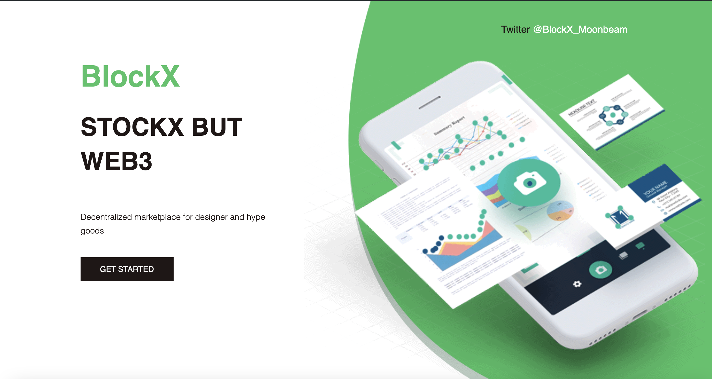
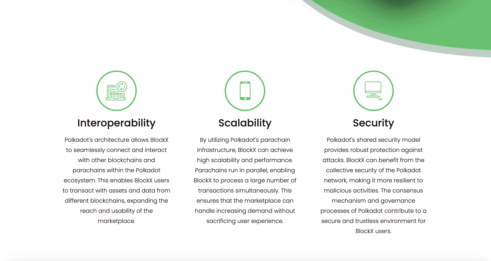
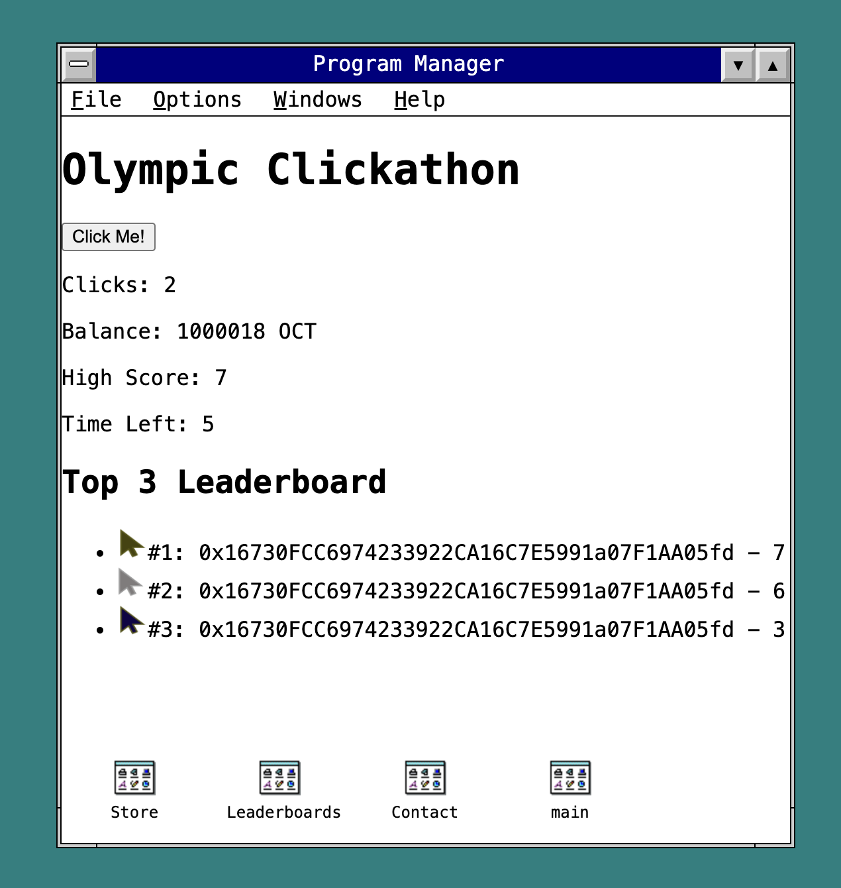

##Previously

##June 2023
###We had BlockX which was marketplace platform for connecting buyers with authentic products.
###We wanted to create a tokenomics experience, by giving those who validated authentic products tokens for them to be used.
###We were able to accomplish a landing page and a basic token smart contract deployed on Moonbeam.

##July 2024
###We pivoted just in time for EasyA Gaming Tracks and the Paris 2024 Olympics to bring you ClickLympics.
###An interactive 5 sec game, where the furious clickers are rewarded.
###Fully interactive front-end and smart contract.
###We have the contract deployed on address  0x78C4f023e15a75f0B60b327455a149775135E0E2 
###https://moonbase.moonscan.io/address/0x78C4f023e15a75f0B60b327455a149775135E0E2